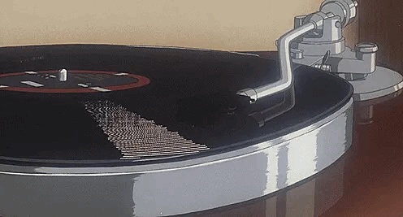

# Tarea 02 - Ejecución y comprensión de procesos de servicios en linux.

<div align=center>
    
</div>

## Contenido
- [Preparación](#preparación)
- [Conceptos (breve + fuentes)](#1---conceptos-breve--fuentes)
- [Práctica guiada (todo en tu `$DAM`)](#2---práctica-guiada-todo-en-tu-dam)
    - [PIDs básicos](#21---pids-básicos)
    - [Servicios **de usuario** con systemd](#22---servicios-de-usuario-con-systemd)
    - [Observación de procesos sin root](#23---observación-de-procesos-sin-root)
    - [Estados y jerarquía (sin root)](#24---estados-y-jerarquía-sin-root)
    - [Limpieza (solo tu usuario)](#25---limpieza-solo-tu-usuario)
- [¿Qué estás prácticando?](#qué-estás-prácticando)

## Preparación

Crea tu área de trabajo y variables útiles:

```bash
mkdir -p ~/dam/{bin,logs,units}
export DAM=~/dam
echo 'export DAM=~/dam' >> ~/.bashrc
```

Comprobar versión de systemd y que el *user manager* está activo:

```bash
systemctl --user --version | head -n1
systemctl --user status --no-pager | head -n5
```
**Pega salida aquí:**

```text
systemd 255 (255.4-1ubuntu8.6)

● a108pc29
    State: running
    Units: 262 loaded (incl. loaded aliases)
     Jobs: 0 queued
   Failed: 0 units
```

**Reflexiona la salida:**

La salida muestra que está instalada la versión `255.4-1ubuntu8.6` de `systemd`. Además, se puede ver que el *user manager* de `systemd` está activo y en ejecución bajo el usuario, ya que la línea que empieza con "● a108pc29" indica que está en estado "running" y que hay 262 unidades cargadas, sin trabajos pendientes ni unidades fallidas.

Esto confirma que el *user systemd* funciona correctamente.

---

## 1 - Conceptos (breve + fuentes)

1) ¿Qué es **systemd** y en qué se diferencia de SysV init?  

**Respuesta:**  

_Fuentes:_

2) **Servicio** vs **proceso** (ejemplos).  

**Respuesta:**  

|  | Producto |	Servicio |
| --- | --- | --- |
| Tangible vs Intangible | Una Smart TV | Acceso a contenido |
| Se fabrica o produce vs Se da en la interacción | Un avión | Viajar en avión |
| Se puede guardar (perdurable) vs No se puede guardar (perecible) | una guitarra | Un concierto de rock |
| Son parecidos vs Son diferentes | Una aspirina | Una consulta médica |

_Fuentes:_ [Diferencia entre Producto y Servicio](https://elevaciondigital.pe/blog/diferencia-entre-productos-y-servicios/)

3) ¿Qué son los **cgroups** y para qué sirven?  

**Respuesta:**  Los cgroups (control groups) son una funcionalidad del kernel Linux que permite agrupar procesos y controlar de manera granular los recursos del sistema que consumen, como CPU, memoria, I/O, y otros.

Los cgroups sirven para:

- Limitar el uso de recursos
- Priorizar procesos
- Aislar procesos
- Monitorear el consumo de recursos
- Controlar procesos en contenedores (Docker, podman,etc.)


_Fuentes:_ [cgroups](https://sergiobelkin.com/posts/que-son-los-cgroups-y-para-que-sirven/)

4) ¿Qué es un **unit file** y tipos (`service`, `timer`, `socket`, `target`)?  

**Respuesta:**  

_Fuentes:_

5) ¿Qué hace `journalctl` y cómo ver logs **de usuario**?  

**Respuesta:**  `journalctl` almacena e indexa todos estos logs para permitir al administrador del sistema gestionarlos desde un único punto. Para filtrar por usuario, tendrás que indicar el número del usuario `journalctl _UID=<identificador>`

_Fuentes:_ [journalctl](https://atareao.es/tutorial/trabajando-con-systemd/journalctl-y-logs-en-systemd/)

---

## 2 - Práctica guiada (todo en tu `$DAM`)

> Si un comando pide permisos que no tienes, usa la **versión `--user`** o consulta el **ayuda** con `--help` para alternativas.

### 2.1 - PIDs básicos

**1.** PID de tu shell y su PPID.

```bash
echo "PID=$$  PPID=$PPID"
```
**Salida:**

```text
PID=24122  PPID=24102
```

**Pregunta:** ¿Qué proceso es el padre (PPID) de tu shell ahora?  

**Respuesta:** El proceso padre (PPID) de mi shell ahora es el proceso con identificador 24102.


**2.** PID del `systemd --user ` (manager de usuario) y explicación.

```bash
pidof systemd || pgrep -u "$USER" -x systemd
```

**Salida:**

```text
3323
```
**Pregunta:** ¿Qué hace el *user manager* de systemd para tu sesión?  

**Respuesta:** Al  obtener el PID con ese comando, indica que el proceso systemd --user está en ejecución con el PID 3323.

---

### 2.2 - Servicios **de usuario** con systemd

Vamos a crear un servicio sencillo y un timer **en tu carpeta** `~/.config/systemd/user` o en `$DAM/units` (usaremos la primera para que `systemctl --user` lo encuentre).

**1.** Prepara directorios y script de práctica.

```bash
mkdir -p ~/.config/systemd/user "$DAM"/{bin,logs}

cat << 'EOF' > "$DAM/bin/fecha_log.sh"
#!/usr/bin/env bash
mkdir -p "$HOME/dam/logs"
echo "$(date --iso-8601=seconds) :: hello from user timer" >> "$HOME/dam/logs/fecha.log"
EOF

chmod +x "$DAM/bin/fecha_log.sh"
```

**2.** Crea el servicio **de usuario** `fecha-log.service` (**Type=simple**, ejecuta tu script).

```bash
cat << 'EOF' > ~/.config/systemd/user/fecha-log.service
[Unit]
Description=Escribe fecha en $HOME/dam/logs/fecha.log

[Service]
Type=simple
ExecStart=%h/dam/bin/fecha_log.sh
EOF

systemctl --user daemon-reload
systemctl --user start fecha-log.service
systemctl --user status fecha-log.service --no-pager -l | sed -n '1,10p'
```
**Salida (pega un extracto):**

```text
○ fecha-log.service - Escribe fecha en $HOME/dam/logs/fecha.log
     Loaded: loaded (/home/dam/.config/systemd/user/fecha-log.service; static)
     Active: inactive (dead)

sep 24 16:55:38 a108pc29 systemd[3665]: Started fecha-log.service - Escribe fecha en $HOME/dam/logs/fecha.log.
```
**Pregunta:** ¿Se creó/actualizó `~/dam/logs/fecha.log`? Muestra las últimas líneas:

```bash
tail -n 5 "$DAM/logs/fecha.log"
```

**Salida:**

```text
2025-09-24T16:55:38+01:00 :: hello from user timer
```

**Reflexiona la salida:**

La salida muestra que el servicio `fecha-log.service` se inició correctamente, pero su estado indica que está inactivo (dead). Esto sugiere que el script `fecha_log.sh` se ejecutó una sola vez y terminó, sin mantener un proceso en ejecución. 

---

**3.** Diferencia **enable** vs **start** (modo usuario). Habilita el **timer**.

```bash
cat << 'EOF' > ~/.config/systemd/user/fecha-log.timer
[Unit]
Description=Timer (usuario): ejecuta fecha-log.service cada minuto

[Timer]
OnCalendar=*:0/1
Unit=fecha-log.service
Persistent=true

[Install]
WantedBy=timers.target
EOF

systemctl --user daemon-reload
systemctl --user enable --now fecha-log.timer
systemctl --user list-timers --all | grep fecha-log || true
```

**Salida (recorta):**

```text
systemctl --user enable --now fecha-log.timer
Created symlink /home/dam/.config/systemd/user/timers.target.wants/fecha-log.timer → /home/dam/.config/systemd/user/fecha-log.timer.

systemctl --user list-timers --all | grep fecha-log || true
Wed 2025-09-24 16:59:00 WEST   6s -                                       - fecha-log.timer                fecha-log.service
```
**Pregunta:** ¿Qué diferencia hay entre `enable` y `start` cuando usas `systemctl --user`?  

**Respuesta:** `start` inicia el servicio/timer solo en ese momento, sin habilitar su inicio automático futuro, en cambio, `enable` habilita y también inicia inmediatamente el servicio/timer, asegurando que se active automáticamente en futuras sesiones.

---

**4.** Logs recientes **del servicio de usuario** con `journalctl --user`.

```bash
journalctl --user -u fecha-log.service -n 10 --no-pager
```

**Salida:**

```text
sep 24 17:02:31 a108pc29 systemd[3665]: Started fecha-log.service - Escribe fecha en $HOME/dam/logs/fecha.log.
sep 24 17:03:31 a108pc29 systemd[3665]: Started fecha-log.service - Escribe fecha en $HOME/dam/logs/fecha.log.
sep 24 17:04:31 a108pc29 systemd[3665]: Started fecha-log.service - Escribe fecha en $HOME/dam/logs/fecha.log.
sep 24 17:05:31 a108pc29 systemd[3665]: Started fecha-log.service - Escribe fecha en $HOME/dam/logs/fecha.log.
sep 24 17:06:31 a108pc29 systemd[3665]: Started fecha-log.service - Escribe fecha en $HOME/dam/logs/fecha.log.
sep 24 17:07:31 a108pc29 systemd[3665]: Started fecha-log.service - Escribe fecha en $HOME/dam/logs/fecha.log.
sep 24 17:08:31 a108pc29 systemd[3665]: Started fecha-log.service - Escribe fecha en $HOME/dam/logs/fecha.log.
sep 24 17:09:31 a108pc29 systemd[3665]: Started fecha-log.service - Escribe fecha en $HOME/dam/logs/fecha.log.
sep 24 17:10:31 a108pc29 systemd[3665]: Started fecha-log.service - Escribe fecha en $HOME/dam/logs/fecha.log.
sep 24 17:11:31 a108pc29 systemd[3665]: Started fecha-log.service - Escribe fecha en $HOME/dam/logs/fecha.log.
```
**Pregunta:** ¿Ves ejecuciones activadas por el timer? ¿Cuándo fue la última?  

**Respuesta:** No se ven ejecuciones activadas explícitamente por el timer en estos logs. Solo se muestran inicios del servicio, pero no la causa (por ejemplo, un disparo del timer).  

La última línea muestra la última vez que se inició el servicio: el 24 de septiembre a las 17:11:31.  

---

### 2.3 - Observación de procesos sin root

**1.** Puertos en escucha (lo que puedas ver como usuario).

```bash
lsof -i -P -n | grep LISTEN || ss -lntp
```
**Salida:**

```text
State  Recv-Q Send-Q   Local Address:Port   Peer Address:Port Process 
LISTEN 0      4096        127.0.0.54:53          0.0.0.0:*            
LISTEN 0      4096         127.0.0.1:631         0.0.0.0:*            
LISTEN 0      4096     127.0.0.53%lo:53          0.0.0.0:*            
LISTEN 0      511          127.0.0.1:6379        0.0.0.0:*            
LISTEN 0      511              [::1]:6379           [::]:*            
LISTEN 0      4096             [::1]:631            [::]:*            
LISTEN 0      511                  *:80                *:*
```
**Pregunta:** ¿Qué procesos *tuyos* están escuchando? (si no hay, explica por qué)  

**Respuesta:** No hay procesos “míos” (del usuario) escuchando en puertos. Todos los que aparecen son servicios del sistema (DNS, CUPS, Redis, servidor web).

---

**2.** Ejecuta un proceso bajo **cgroup de usuario** con límite de memoria.

```bash
systemd-run --user --scope -p MemoryMax=50M sleep 200
ps -eo pid,ppid,cmd,stat | grep "[s]leep 200"
```

**Salida:**

```text
Running as unit: run-rc89fb039ef3547a6a1abf2adbcb08855.scope; invocation ID: e4f945a953294439a4c96f45cbe22939
```
**Pregunta:** ¿Qué ventaja tiene lanzar con `systemd-run --user` respecto a ejecutarlo “a pelo”?  

**Respuesta:** La ventaja es que `systemd-run --user` ejecuta el proceso dentro de un `cgroup` gestionado por `systemd`, lo que permite aplicar y mantener límites de recursos (como memoria, CPU, I/O) de forma aislada, monitorizable y sin necesidad de ser root; mientras que si lo ejecutas directamente no tienes esa gestión ni control de recursos.

---

**3.** Observa CPU en tiempo real con `top` (si tienes `htop`, también vale).

```bash
top -b -n 1 | head -n 15
```
**Salida (resumen):**

```text
top - 18:56:43 up 8 min,  1 user,  load average: 0,52, 0,53, 0,36
Tasks: 225 total,   1 running, 224 sleeping,   0 stopped,   0 zombie
%Cpu(s):  4,5 us,  2,3 sy,  0,0 ni, 88,6 id,  2,3 wa,  0,0 hi,  2,3 si,  0,0 st 
MiB Mem :   3818,9 total,    628,2 free,   1964,9 used,   1514,2 buff/cache     
MiB Swap:    512,0 total,    512,0 free,      0,0 used.   1854,0 avail Mem 

    PID USER      PR  NI    VIRT    RES    SHR S  %CPU  %MEM     TIME+ COMMAND
   4868 chugani   20   0   17032   5596   3548 R   9,1   0,1   0:00.01 top
      1 root      20   0   22760  13368   9144 S   0,0   0,3   0:01.49 systemd
      2 root      20   0       0      0      0 S   0,0   0,0   0:00.02 kthreadd
      3 root      20   0       0      0      0 S   0,0   0,0   0:00.00 pool_wo+
      4 root       0 -20       0      0      0 I   0,0   0,0   0:00.00 kworker+
      5 root       0 -20       0      0      0 I   0,0   0,0   0:00.00 kworker+
      6 root       0 -20       0      0      0 I   0,0   0,0   0:00.00 kworker+
      7 root       0 -20       0      0      0 I   0,0   0,0   0:00.00 kworker+
```
**Pregunta:** ¿Cuál es tu proceso con mayor `%CPU` en ese momento?  

**Respuesta:** Mi proceso con mayor %CPU en ese momento es top (PID 4868), con 9,1 %.

---

**4.** Traza syscalls de **tu propio proceso** (p. ej., el `sleep` anterior).
> Nota: Sin root, no podrás adjuntarte a procesos de otros usuarios ni a algunos del sistema.

```bash
pid=$(pgrep -u "$USER" -x sleep | head -n1)
strace -p "$pid" -e trace=nanosleep -tt -c -f 2>&1 | sed -n '1,10p'
```

**Salida (fragmento):**

```text
[1]+  Done                    systemd-run --user --scope -p MemoryMax=50M sleep 200
strace: must have PROG [ARGS] or -p PID
Try 'strace -h' for more information.
```
**Pregunta:** Explica brevemente la syscall que observaste.  

**Respuesta:** La syscall observada es `nanosleep`, que suspende el proceso durante el tiempo solicitado (en este caso 200 segundos). Es la forma en que el kernel implementa la función `sleep` de usuario.

---

### 2.4 - Estados y jerarquía (sin root)

**1.** Árbol de procesos con PIDs.

```bash
pstree -p | head -n 50
```

**Salida (recorta):**

```text
systemd(1)-+-ModemManager(939)-+-{ModemManager}(959)
           |                   |-{ModemManager}(966)
           |                   `-{ModemManager}(973)
           |-NetworkManager(855)-+-{NetworkManager}(948)
           |                     |-{NetworkManager}(949)
           |                     `-{NetworkManager}(953)
           |-VBoxClient(1778)---VBoxClient(1780)-+-{VBoxClient}(1783)
           |                                     |-{VBoxClient}(1784)
           |                                     `-{VBoxClient}(1785)
           |-VBoxClient(1787)---VBoxClient(1789)-+-{VBoxClient}(1792)
           |                                     |-{VBoxClient}(1793)
           |                                     `-{VBoxClient}(1794)
           |-VBoxClient(1797)---VBoxClient(1799)-+-{VBoxClient}(1808)
           |                                     |-{VBoxClient}(1810)
           |                                     |-{VBoxClient}(1814)
           |                                     `-{VBoxClient}(1817)

```
**Pregunta:** ¿Bajo qué proceso aparece tu `systemd --user`?  

**Respuesta:** Mi `systemd --user` aparece bajo el proceso que inicia mi sesión, y ese a su vez cuelga de `systemd(1)`.

---

**2.** Estados y relación PID/PPID.

```bash
ps -eo pid,ppid,stat,cmd | head -n 20
```
**Salida:**

```text
    PID    PPID STAT CMD
      1       0 Ss   /sbin/init splash
      2       0 S    [kthreadd]
      3       2 S    [pool_workqueue_release]
      4       2 I<   [kworker/R-rcu_gp]
      5       2 I<   [kworker/R-sync_wq]
      6       2 I<   [kworker/R-slub_flushwq]
      7       2 I<   [kworker/R-netns]
     11       2 I    [kworker/u16:0-ipv6_addrconf]
     12       2 I<   [kworker/R-mm_percpu_wq]
     13       2 I    [rcu_tasks_kthread]
     14       2 I    [rcu_tasks_rude_kthread]
     15       2 I    [rcu_tasks_trace_kthread]
     16       2 S    [ksoftirqd/0]
     17       2 I    [rcu_preempt]
     18       2 S    [rcu_exp_par_gp_kthread_worker/0]
     19       2 S    [rcu_exp_gp_kthread_worker]
     20       2 S    [migration/0]
     21       2 S    [idle_inject/0]
     22       2 S    [cpuhp/0]
```
**Pregunta:** Explica 3 flags de `STAT` que veas (ej.: `R`, `S`, `T`, `Z`, `+`).  

**Respuesta:** De los flags observados:
- `S` = proceso dormido esperando un evento.
- `I` = proceso/hilo del kernel inactivo.
- `<` = el proceso tiene prioridad alta y no es posible reducirla con `nice`.

---

**3.** Suspende y reanuda **uno de tus procesos** (no crítico).

```bash
# Crea un proceso propio en segundo plano
sleep 120 &
pid=$!
# Suspende
kill -STOP "$pid"
# Estado
ps -o pid,stat,cmd -p "$pid"
# Reanuda
kill -CONT "$pid"
# Estado
ps -o pid,stat,cmd -p "$pid"
```
**Pega los dos estados (antes/después):**

Antes:
```text
    PID STAT CMD
  12096 T    sleep 120
```

Después:
```text
    PID STAT CMD
  12096 S    sleep 120
```
**Pregunta:** ¿Qué flag indicó la suspensión?  

**Respuesta:** El flag que indicó la suspensión fue `T`, que significa *stopped* (proceso detenido por señal, como `SIGSTOP` o `SIGTSTP`).

---

**4. (Opcional)** Genera un **zombie** controlado (no requiere root).

```bash
cat << 'EOF' > "$DAM/bin/zombie.c"
#include <stdlib.h>
#include <unistd.h>
int main() {
  if (fork() == 0) { exit(0); } // hijo termina
  sleep(60); // padre no hace wait(), hijo queda zombie hasta que padre termine
  return 0;
}
EOF
gcc "$DAM/bin/zombie.c" -o "$DAM/bin/zombie" && "$DAM/bin/zombie" &
ps -el | grep ' Z '
```
**Salida (recorta):**

```text
gcc "$DAM/bin/zombie.c" -o "$DAM/bin/zombie" && "$DAM/bin/zombie" &
[1] 129931

ps -el | grep ' Z '
1 Z  1001  129944  129943  0  80   0 -     0 -      pts/0    00:00:00 zombie
```

**Pregunta:** ¿Por qué el estado `Z` y qué lo limpia finalmente?  

**Respuesta:** El estado `Z` significa que el hijo terminó pero su padre aún no llamó a `wait()`. El zombie se limpia automáticamente cuando el padre finaliza y `systemd` adopta al hijo y hace el `wait()`.

---

### 2.5 - Limpieza (solo tu usuario)

Detén y deshabilita tu **timer/servicio de usuario** y borra artefactos si quieres.

```bash
systemctl --user disable --now fecha-log.timer
systemctl --user stop fecha-log.service
rm -f ~/.config/systemd/user/fecha-log.{service,timer}
systemctl --user daemon-reload
rm -rf "$DAM/bin" "$DAM/logs" "$DAM/units"
```

**Salida**

```text
systemctl --user disable --now fecha-log.timer
Removed "/home/dam/.config/systemd/user/timers.target.wants/fecha-log.timer".
[1]+  Hecho                   gcc "$DAM/bin/zombie.c" -o "$DAM/bin/zombie" && "$DAM/bin/zombie"

systemctl --user stop fecha-log.service

rm -f ~/.config/systemd/user/fecha-log.{service,timer}
'/home/dam/.config/systemd/user/fecha-log.service' borrado
'/home/dam/.config/systemd/user/fecha-log.timer' borrado

systemctl --user daemon-reload

rm -rf "$DAM/bin" "$DAM/logs" "$DAM/units"
'/home/dam/dam/bin/zombie.c' borrado
'/home/dam/dam/bin/fecha_log.sh' borrado
'/home/dam/dam/bin/zombie' borrado
removed directory '/home/dam/dam/bin'
'/home/dam/dam/logs/fecha.log' borrado
removed directory '/home/dam/dam/logs'
removed directory '/home/dam/dam/units'
```

## ¿Qué estás prácticando?
- [X] Pegaste **salidas reales**.  
- [X] Explicaste **qué significan**.  
- [X] Usaste **systemd --user** y **journalctl --user**.  
- [X] Probaste `systemd-run --user` con límites de memoria.  
- [X] Practicaste señales (`STOP`/`CONT`), `pstree`, `ps` y `strace` **sobre tus procesos**.
