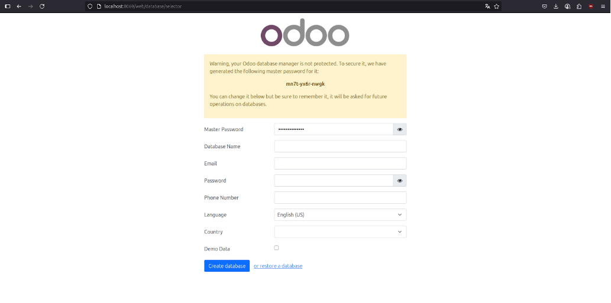
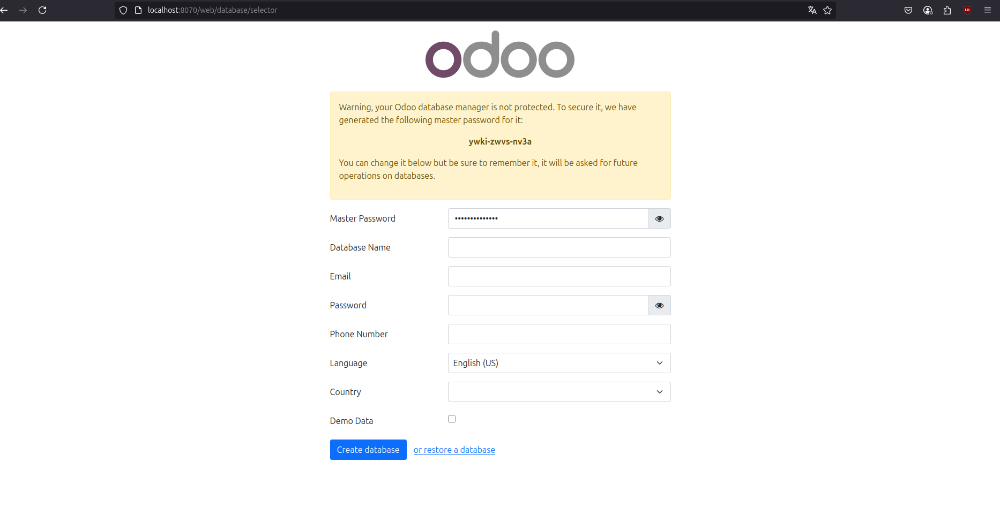
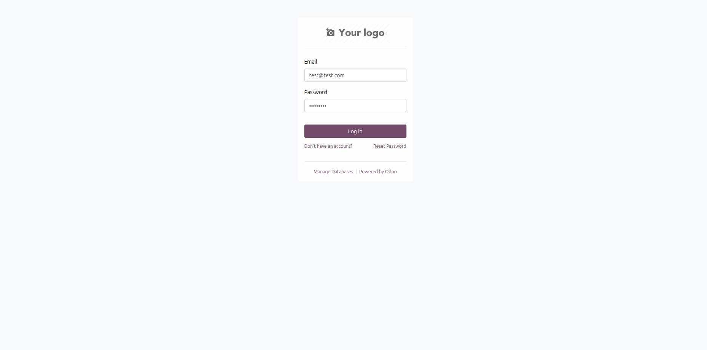
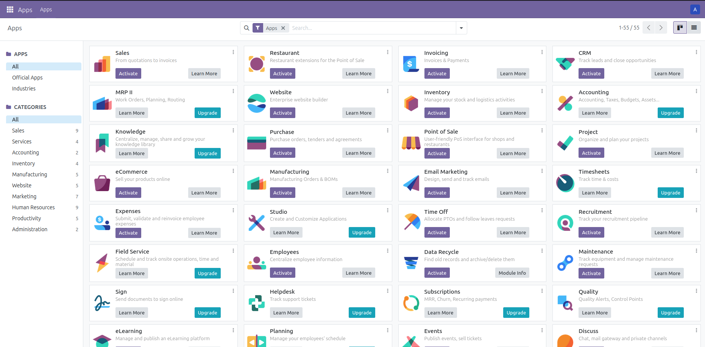
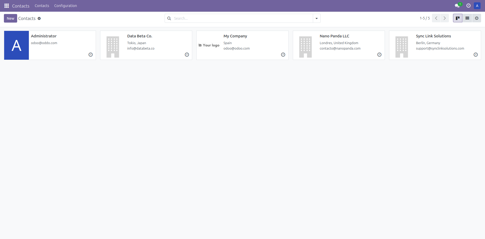
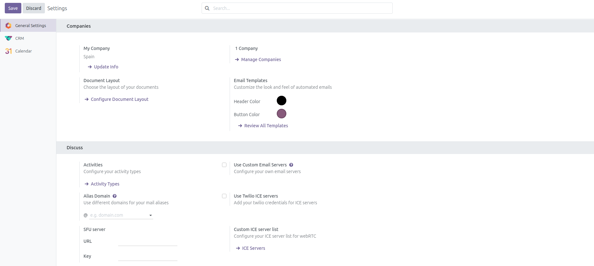
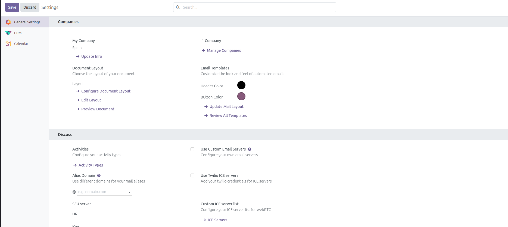

# Instalación y configuración de Odoo

<div align=center>
    
</div>

## Instalación de Odoo

1. Descargamos ambos ficheros `docker-compose.yml` y los guardamos en su debida carpeta, deberia quedar una estructura parecida a la siguiente: 

```bash
Oddo
 ├── desarrollo
 │   ├── docker-compose.yml
 │
 └── produccion
     ├── docker-compose.yml
```

2. Desde dos terminal distintas accedemos a `Oddo/desarrollo` y `Oddo/produccion` y lanzamos el sigueinte comando:

```bash
docker compose up -d
```

3. Una vez hecho esto dentro de ambos archivos, ya hemos despregado oddo en entrorno produccion y desarrollo. Pra acceder usamos `localhost`.

**Desarrollo [localhost:8069](http://localhost:8069/)**
<div align=center>
    
</div>

**Producción [localhost:8070](http://localhost:8070/)**
<div align=center>
    
</div>

## Accede a tu Odoo (producción o desarrollo).
<div align=center>
    
</div>

## Recorre el menú de aplicaciones y nota que puedes instalar módulos.
<div align=center>
    
</div>

## Instala CRM y Contactos.
<div align=center>
    
</div>

## Crea 3 clientes ficticios con datos básicos (nombre, email, teléfono).
<div align=center>
    
</div>

## Activa el modo desarrollador (en Ajustes) y mira cómo aparecen más opciones.

Vamos a ver un antes y un después de acticar el modo desarollador mediente un ejemplo:

**Before**
<div align=center>
    
</div>

**After**
<div align=center>
    
</div>