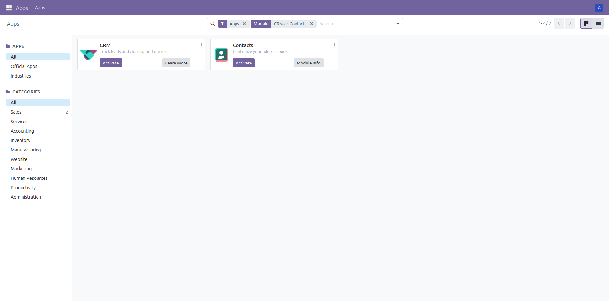

# Instalación y configuración de Odoo

    

## Accede a tu Odoo (producción o desarrollo).

    

## Recorre el menú de aplicaciones y nota que puedes instalar módulos.

    

## Instala CRM y Contactos.

    

## Crea 3 clientes ficticios con datos básicos (nombre, email, teléfono).
## Activa el modo desarrollador (en Ajustes) y mira cómo aparecen más opciones.
